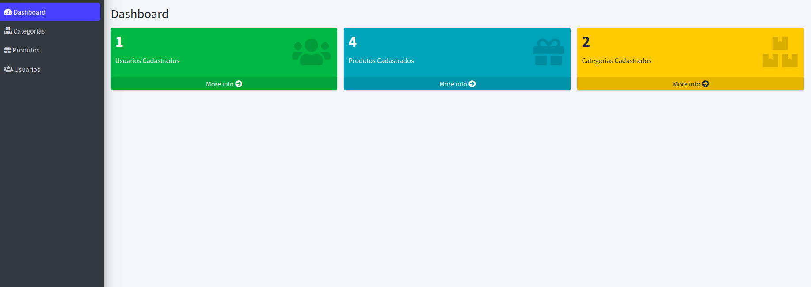
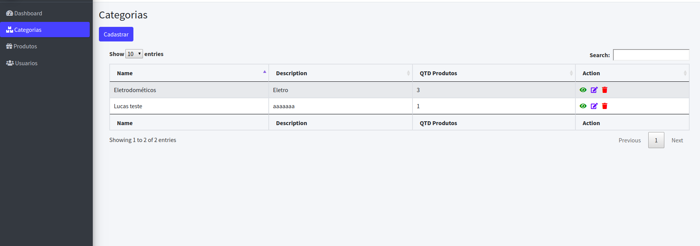
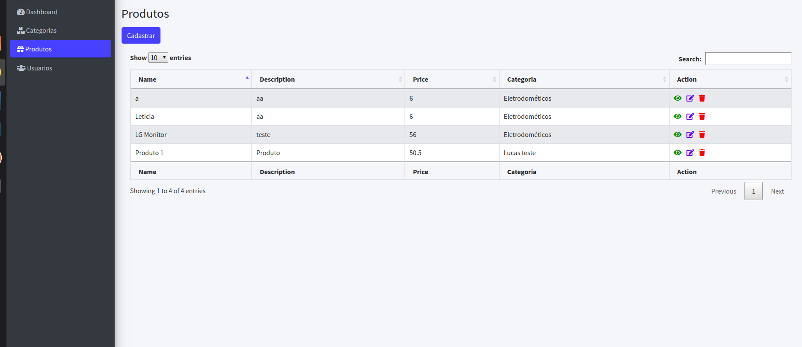

<h3>TESTE DE CATEGORIAS E PRODUTOS DA SPOT</h3>

<h6>Criei uma parte admistrativa para gerenciar o CRUD entao vocês vão precisar fazer um mini cadastro</h6>

<h6>Segue como ficou mais ou menos no meu computador</h6>
<h5>Parte da Dashboard</h5>
</img>
<h5>Parte de Categorias</h5>
</img>
<h5>Parte de Produtos</h5>
</img>

##PS: Acrescentei alguns,campos na modelagem de dados

##PS 2: Desculpa pelo relaxo na datatable

##PS 3: Deixei commitado as estapas e documentado 
